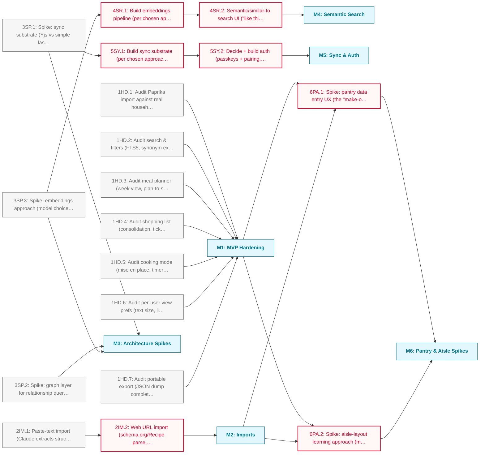

# Kitchen Gremlin Beyond MVP Roadmap

The local-only MVP (Paprika import, search, meal planner, shopping list,
cooking mode, per-user view prefs, portable export) is built. This phase
hardens it, completes the remaining v1 import paths, resolves open
architecture questions with spikes, and builds semantic search and
multi-device sync on top of those spikes.

**Critical path:** `3SP.3 → 4SR.1 → 4SR.2` and `3SP.1 → 5SY.1 → 5SY.2`; the
embeddings spike gates semantic search, the sync spike gates multi-device
sync and auth. `M1`/`M2` gate the pantry/aisle spikes (M6), sequenced after
existing systems ship.

---

## Milestone 1: MVP Hardening

**Goal:** Confirm what's built actually works before layering new architecture on top.

- [ ] **1HD.1**: Audit Paprika import against real household export
- [ ] **1HD.2**: Audit search & filters (FTS5, synonym expansion, facets)
- [ ] **1HD.3**: Audit meal planner (week view, plan-to-shopping-list)
- [ ] **1HD.4**: Audit shopping list (consolidation, tick-off, manual items)
- [ ] **1HD.5**: Audit cooking mode (mise en place, timers, wake lock, cook log)
- [ ] **1HD.6**: Audit per-user view prefs (text size, line spacing, checklist steps)
- [ ] **1HD.7**: Audit portable export (JSON dump completeness)

---

## Milestone 2: Imports

**Goal:** Complete the three documented v1 import paths (only Paprika exists today).

- [ ] **2IM.1**: Paste-text import (Claude extracts structured recipe from pasted text)
- [ ] **2IM.2**: Web URL import (schema.org/Recipe parse, Claude fallback for messy blogs) _(blocked: depends on 2IM.1)_

---

## Milestone 3: Architecture Spikes

**Goal:** Resolve open architecture questions before committing to a build.

- [ ] **3SP.1**: Spike: sync substrate (Yjs vs simple last-write-wins relay)
- [ ] **3SP.2**: Spike: graph layer for relationship queries (substitutions, pantry-match, ingredient graphs — Neo4j vs SQLite recursive CTEs vs defer)
- [ ] **3SP.3**: Spike: embeddings approach (model choice, generation process, Voyage vs alternatives)

---

## Milestone 4: Semantic Search

**Goal:** Ship the killer feature (SPEC.md §3).

- [ ] **4SR.1**: Build embeddings pipeline (per chosen approach from 3SP.3) _(blocked: depends on 3SP.3)_
- [ ] **4SR.2**: Semantic/similar-to search UI ("like this but quicker") _(blocked: depends on 4SR.1)_

---

## Milestone 5: Sync & Auth

**Goal:** Multi-device household sync.

- [ ] **5SY.1**: Build sync substrate (per chosen approach from 3SP.1) _(blocked: depends on 3SP.1)_
- [ ] **5SY.2**: Decide + build auth (passkeys + pairing, per SPEC.md §6, or reconsider) _(blocked: depends on 5SY.1)_

---

## Milestone 6: Pantry & Aisle Spikes

**Goal:** Explore pantry-aware and aisle-learning UX, sequenced after existing systems ship.

- [ ] **6PA.1**: Spike: pantry data entry UX (the "make-or-break" problem — SPEC.md §9.5) _(blocked: depends on M1, M2)_
- [ ] **6PA.2**: Spike: aisle-layout learning approach (manual/learned/crowdsourced — SPEC.md §9.6) _(blocked: depends on M1, M2)_

---

## Dependency Diagram

